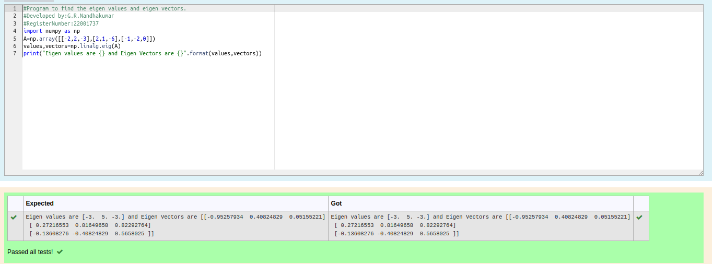

# EIGENVALUES-AND-EIGENVECTORS
## Aim:
To write a python program to find the Eigenvalues and Eigen Vectors
## Equipment’s required:
1. 	Hardware – PCs
2. 	Anaconda – Python 3.7 Installation / Moodle-Code Runner
## Algorithm:

### Step1 : 

Initialize the program with import

### Step 2: 

Convert the matrix into array using array command

### Step 3: 

Using the np.linalg.eig(),  we get two results (first is eigenvalue and second is eigenvector) of the given matrix.

### Step 4: 

End the program

## Program:
```python
#Program to find the eigen values and eigen vectors.
#Developed by:G.R.Nandhakumar
#RegisterNumber:22001737
import numpy as np
A=np.array([[-2,2,-3],[2,1,-6],[-1,-2,0]])
values,vectors=np.linalg.eig(A)
print("Eigen values are {} and Eigen Vectors are {}".format(values,vectors))
```

## Output:



## Result:
Thus the Eigenvalue and Eigenvector is successfully solved using python program
